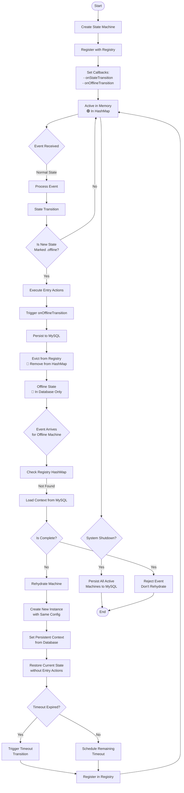
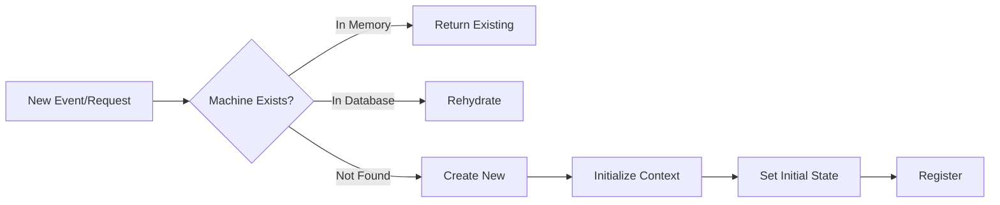
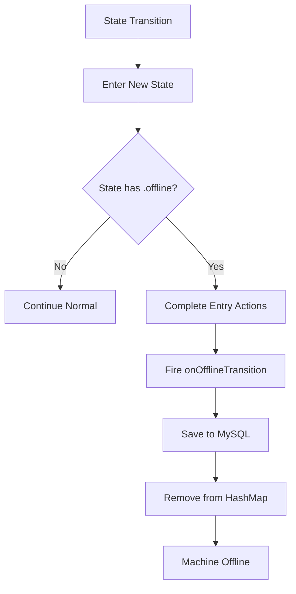
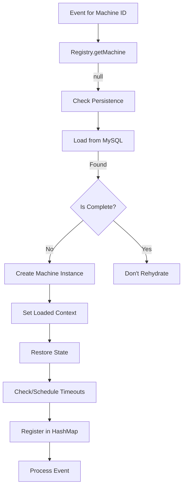
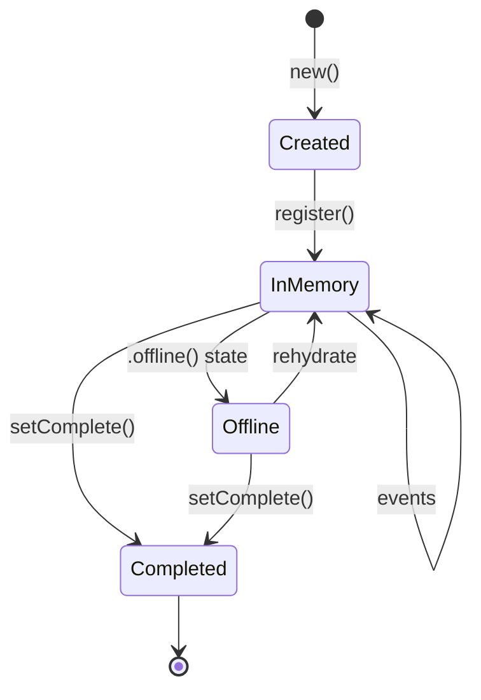
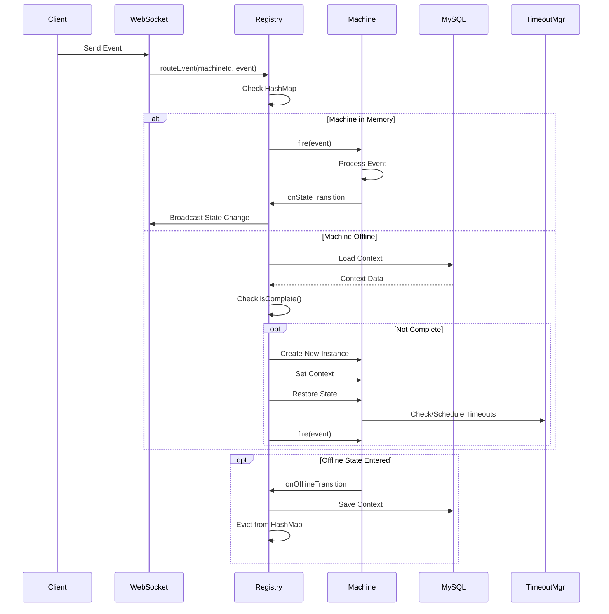
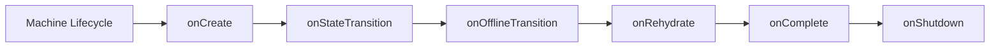
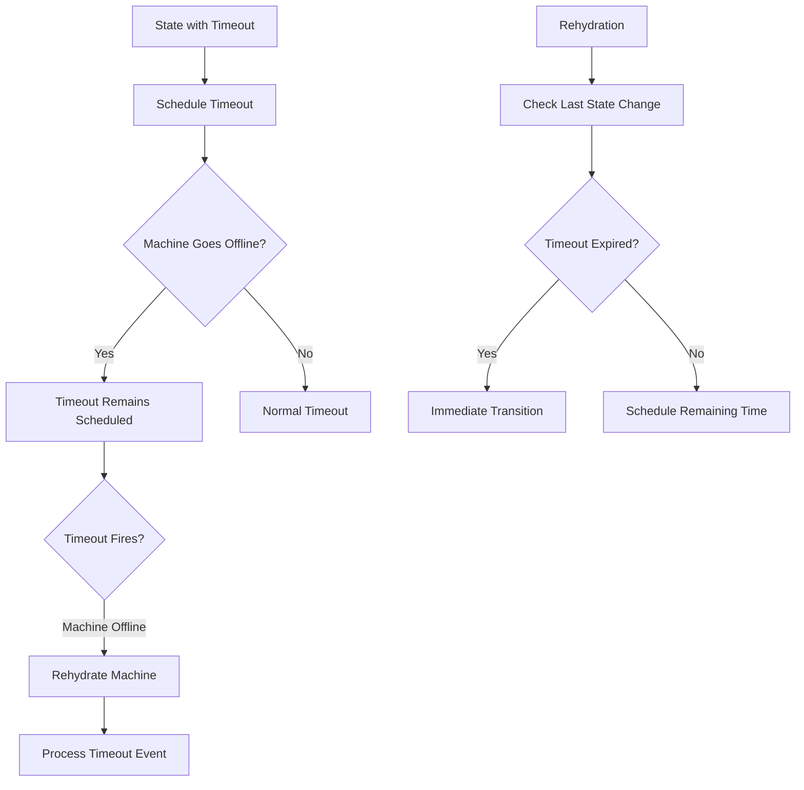
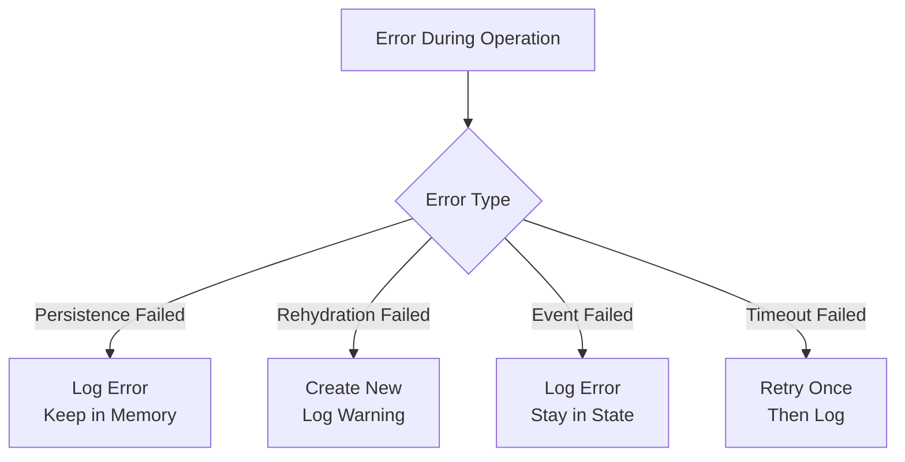

# State Machine Lifecycle Flow Diagram

## Complete Lifecycle Overview

## Detailed Sub-Flows

### 1. Machine Creation Flow

### 2. Offline Transition Flow

### 3. Rehydration Flow

## State Machine States

## Key Components Interaction

## Memory Management States

| State | In Memory | In Database | Can Process Events | Notes |
|-------|-----------|-------------|-------------------|--------|
| **Active** | ✅ Yes | ❌ No* | ✅ Yes | Normal operation |
| **Offline** | ❌ No | ✅ Yes | 🔄 Via Rehydration | Memory efficient |
| **Rehydrating** | 🔄 Loading | ✅ Yes | ⏳ After Load | Transient state |
| **Completed** | ❌ No | ✅ Yes | ❌ No | Terminal state |

*Can be persisted on shutdown or for debugging

## Lifecycle Events & Callbacks

## Data Flow During Lifecycle

### What Gets Persisted:
- ✅ Persistent Context (Entity)
- ✅ Current State
- ✅ Last State Change
- ✅ Completion Status
- ✅ Custom Fields (JSON)

### What Starts Fresh:
- 🔄 Volatile Context
- 🔄 Event Handlers
- 🔄 Runtime Caches
- 🔄 WebSocket Connections

## Timeout Handling Across Lifecycle

## Performance Considerations

| Operation | Time Complexity | Space Impact | Database Calls |
|-----------|----------------|--------------|----------------|
| Create New | O(1) | +1 Machine | 0 |
| Fire Event (Active) | O(1) | 0 | 0 |
| Go Offline | O(1) | -1 Machine | 1 (Save) |
| Rehydrate | O(1) | +1 Machine | 1 (Load) |
| Check Complete | O(1) | 0 | 1 (Query) |
| Bulk Shutdown | O(n) | 0 | n (Save All) |

## Error Recovery

## Best Practices

1. **Mark Appropriate States as Offline**
   - Long-running states (CONNECTED, WAITING)
   - States with minimal activity
   - States before external callbacks

2. **Don't Mark as Offline**
   - Transient states (PROCESSING)
   - States with frequent events
   - States with complex volatile data

3. **Rehydration Optimization**
   - Use ID patterns for type detection
   - Cache frequently accessed machines
   - Batch load related machines

4. **Monitoring**
   - Track rehydration frequency
   - Monitor persistence latency
   - Alert on rehydration failures